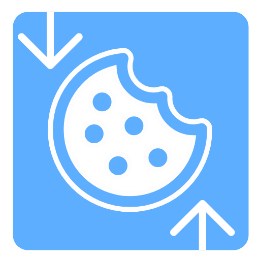

<div align="center">
  
  <h1>CookieCloud Community for Firefox</h1>
  <p><strong>将浏览器 Cookie 与可选的 Local Storage 加密同步到你自己的服务器</strong></p>
  <p>基于 easychen/CookieCloud 的 Firefox 社区适配版，同时面向 Firefox Desktop 与 Firefox Android。</p>

  <p>
    <a href="https://github.com/NeoHeee/CookieCloud/actions/workflows/build-firefox.yml">获取最新构建</a> ·
    <a href="PRIVACY.md">隐私说明</a> ·
    <a href="https://github.com/easychen/CookieCloud">上游项目</a>
  </p>

  <p>
    
    
    
    
  </p>
</div>

---

## 项目说明

CookieCloud 由浏览器扩展和可自建服务端组成。扩展读取用户指定范围内的 Cookie，并可在明确启用后同步对应网站的 Local Storage；同步内容在浏览器本地加密后，发送到用户配置的 CookieCloud 服务端。

本仓库复刻自 [easychen/CookieCloud](https://github.com/easychen/CookieCloud)，主要补充：

- Firefox Desktop 与 Firefox Android Manifest 兼容配置；
- Android 移动端自适应布局和触控尺寸优化；
- GitHub Actions 可复现构建、Manifest 校验及 Mozilla `web-ext lint`；
- AMO 源码审核包、构建说明和隐私说明；
- Firefox 独立扩展 ID 与数据收集声明。

> 本仓库是社区维护的 Firefox 适配版本，不是 easychen 原作者发布的官方 Firefox 扩展。

## 当前版本

### Firefox v1.0.4

- Firefox Desktop：支持；
- Firefox Android：声明支持 Firefox 120 及以上版本；
- Android 页面：扩展操作页会自适应手机全屏，按钮增加触控高度并兼容底部安全区；
- 自动检查：TypeScript、Firefox Manifest、Mozilla `web-ext lint`；
- 真机状态：自动化兼容检查已加入，公开发布前仍建议在 Android 真机完成一轮功能复测。

同一个 Firefox ZIP 包同时用于桌面版和 Android 版，平台兼容信息由 `browser_specific_settings.gecko` 与 `gecko_android` 声明。

## 浏览器支持

| 浏览器 | 状态 | 说明 |
|---|---|---|
| Firefox Desktop | ✅ 支持 | 已完成桌面端功能测试 |
| Firefox Android 120+ | 🧪 已适配 | Manifest 与移动布局已完成，待真机完整复测 |
| Chrome | ✅ 上游支持 | 建议使用 easychen 官方商店版本 |
| Microsoft Edge | ✅ 上游支持 | 建议使用 easychen 官方商店版本 |
| 其他 Chromium 浏览器 | ⚠️ 未完整验证 | 参考上游项目说明 |

Firefox 与 Chromium 的 Cookie 数据结构存在差异，**不要让 Firefox 与 Chrome/Edge 使用同一个上传 UUID**，避免相互覆盖。

## 获取 Firefox 1.0.4 测试包

打开：

```text
GitHub 仓库 → Actions → Build Firefox Extension → 最新成功运行
```

下载构建产物：

```text
cookiecloud-firefox-v1.0.4-desktop-android
```

解压后得到未签名 Firefox ZIP。桌面测试可通过 `about:debugging` 临时载入；Android 测试建议使用 Firefox Nightly 或开发环境配合 `web-ext`。

官方 AMO 公开版本需在完成 Android 真机复测后，将 1.0.4 未签名 ZIP 和对应源码包提交 Mozilla 审核。

## Firefox Android 测试重点

1. 扩展页面能否正常打开，并完整显示所有配置项；
2. 输入法弹出时服务器地址、UUID、密码等输入框是否仍可滚动到可见区域；
3. 保存设置后重启 Firefox，配置是否保留；
4. 手动上传、下载及测试按钮是否正常；
5. 定时同步是否会在浏览器后台运行；
6. Cookie 覆盖后目标网站登录状态是否恢复；
7. 启用 Local Storage 后，对应数据是否正确同步；
8. 页面底部按钮是否被 Android 导航栏或手势区域遮挡。

## 安全须知

Cookie 是网站登录状态的重要凭据。CookieCloud 为实现同步，需要申请读取网站 Cookie 和访问网站数据的高权限。请按高敏感工具管理：

- 优先使用自己的 CookieCloud 服务端，不建议长期使用公共测试服务器；
- 服务端必须使用 HTTPS，避免公网明文传输；
- UUID 和密码均使用独立随机值，密码建议至少 24 位；
- 不要同步网银、支付、主邮箱、密码管理器、域名注册商、Cloudflare、NAS 管理后台等关键账户；
- Local Storage 可能包含长期 Token，不需要时不要开启；
- Firefox、Chrome 和 Edge 分别使用不同 UUID；
- 定期更换密码，停用时清除服务端数据和本地扩展配置。

扩展在上传前会在浏览器本地加密同步内容，但加密不能消除弱密码、浏览器失陷、恶意服务端或配置泄露带来的风险。详见 [隐私说明](PRIVACY.md)。

## 自建服务端

### Docker Compose

```yaml
services:
  cookiecloud:
    image: easychen/cookiecloud:latest
    container_name: cookiecloud
    restart: unless-stopped
    ports:
      - "8088:8088"
    volumes:
      - ./data:/data/api/data
    environment:
      API_ROOT: /cookiecloud-your-random-path
```

启动：

```bash
docker compose up -d
```

扩展中的服务器地址示例：

```text
https://cookie.example.com/cookiecloud-your-random-path
```

生产环境建议使用可信反向代理或 Cloudflare Tunnel 提供 HTTPS，不要直接将 `8088` 的 HTTP 服务暴露到公网。

## Firefox 源码构建

```bash
git clone https://github.com/NeoHeee/CookieCloud.git
cd CookieCloud/ext

corepack enable
corepack prepare pnpm@10.28.0 --activate
pnpm install --frozen-lockfile
pnpm compile
pnpm zip:firefox
```

构建结果位于：

```text
ext/dist/*firefox*.zip
```

详细可复现构建信息见 [ext/AMO_BUILD.md](ext/AMO_BUILD.md)。

## 项目关系与许可证

- 上游项目：[easychen/CookieCloud](https://github.com/easychen/CookieCloud)
- Firefox 社区适配：[NeoHeee/CookieCloud](https://github.com/NeoHeee/CookieCloud)
- 问题反馈：[GitHub Issues](https://github.com/NeoHeee/CookieCloud/issues)
- 隐私说明：[PRIVACY.md](PRIVACY.md)
- 许可证：[GNU General Public License v3.0](LICENSE)

感谢原作者 easychen 及所有贡献者。本仓库的改动继续按照 GPL-3.0 发布。
